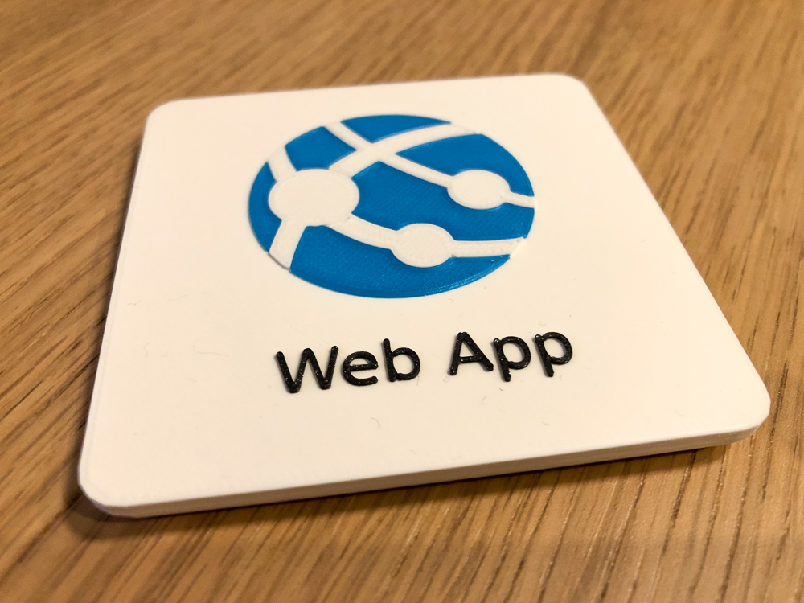
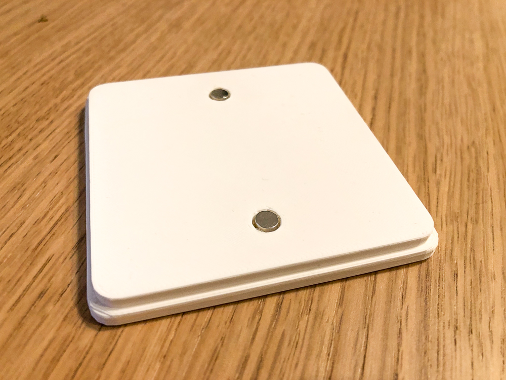
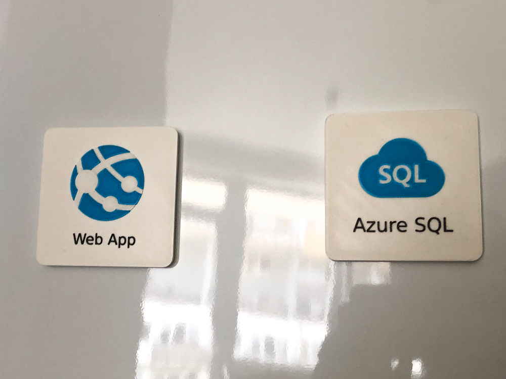

## Azure Services Whiteboard Magnets

### Overview

Do you draw a cloud architecture diagrams on whiteboard and are you lousy painter as me? I wanted to speed up my work and make it more readable - so I have designed my custom magnets of mostly used Azure services and printed on 3D printer.

All models are in STL format, ready to be printed with multi-material 3D printer (like *Prusa MMU2S*) - originally designed in OpenSCAD.

All models requires maximum *5* colors at once. For my printing i used PLA material, but also ABS test looked pretty good.

In `_print_exports/` folder are optimized ready-to print `.3mf` projects.

### BOM
- PLA filaments, the easiest icon requires *3* colors: *white, black, azure*
- for every icon you need *2pcs* of neodymium magnets *5x2mm* ([Aliexpress link](https://www.aliexpress.com/item/1005002226582762.html?))
- glue

### Photos

### Available icons



### Assembly instructions

1. print icons on 3D printer
1. prepare neodymium magnets, glue
1. check magnets sides - in case you want to stock magnets, check you glue magnets in same pole in every icon
1. glue magnets into holes

### Support or Contact

Have you found any issue or do you want to request another service icon to create? Please [create a new issue on GitHub](https://github.com/vjirovsky/cloudmagnets-az/issues).
