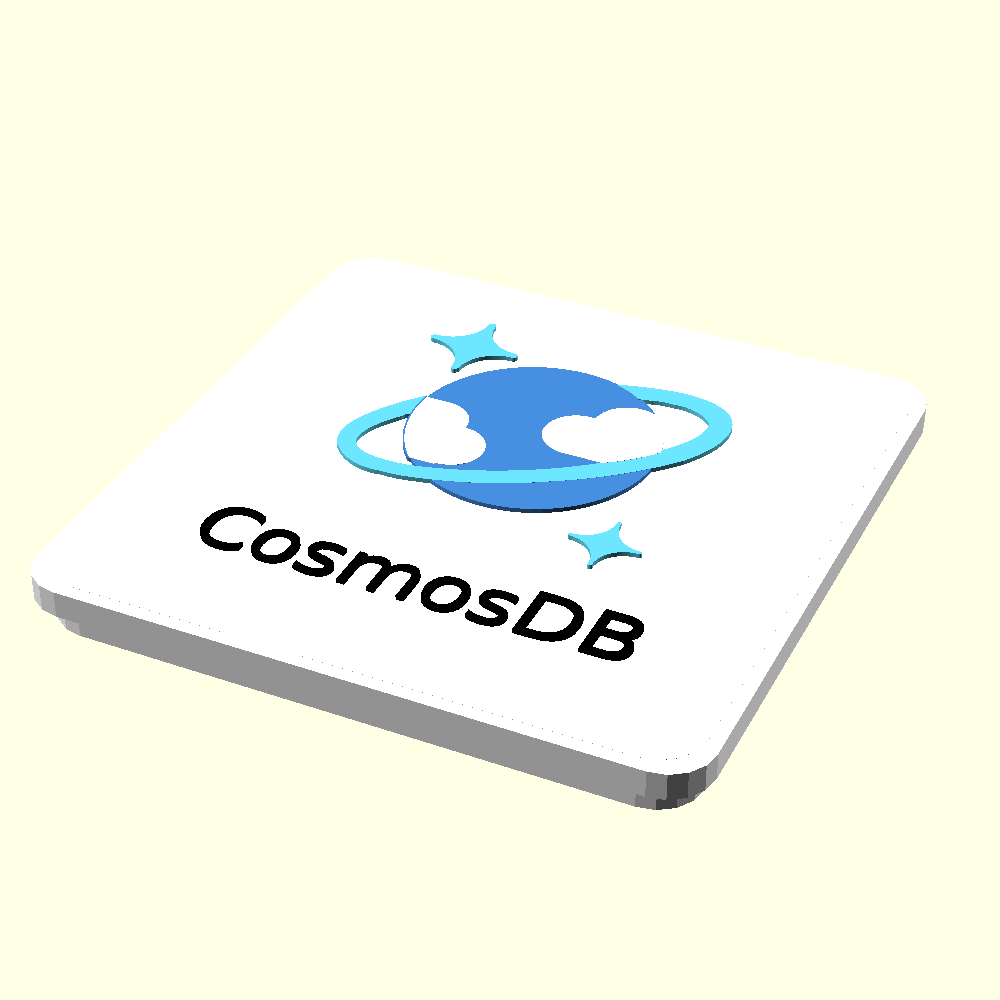

## Welcome to GitHub Pages

You can use the [editor on GitHub](https://github.com/vjirovsky/cloudmagnets-az/edit/main/docs/index.md) to maintain and preview the content for your website in Markdown files.

Whenever you commit to this repository, GitHub Pages will run [Jekyll](https://jekyllrb.com/) to rebuild the pages in your site, from the content in your Markdown files.


First Header | Second Header
------------ | -------------
Resource Group |  
Subscription |  
Cosmos DB |  
Key Vault |  


### Markdown

Markdown is a lightweight and easy-to-use syntax for styling your writing. It includes conventions for

```markdown
Syntax highlighted code block

### Support or Contact

Having trouble with Pages? Check out our [documentation](https://docs.github.com/categories/github-pages-basics/) or [contact support](https://support.github.com/contact) and we’ll help you sort it out.
